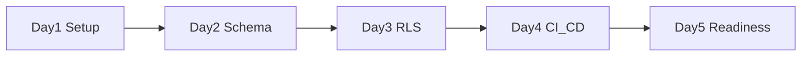

# Week 1 Execution Board

## Purpose
Provide a concrete Day 1-Day 5 execution plan to start V1 delivery immediately after scope sign-off.

## Audience
PM, engineering, QA, and stakeholders tracking week-1 progress.

## Executive Summary
- Week 1 is foundation-only: repo bootstrap, stack baseline, Supabase tenancy/RLS skeleton, and CI/CD guardrails.
- No feature expansion beyond onboarding/foundation setup this week.
- Daily completion criteria are explicit to prevent drift.

## Week 1 Objectives

| Objective | Outcome by End of Week |
| --- | --- |
| Delivery foundation | Monorepo/app baseline ready with Next.js + Tailwind + TypeScript |
| Data safety baseline | Supabase core schema and initial RLS policies working |
| Release discipline | GitHub CI/CD with required checks and preview deploy path |
| Operational readiness | Environment/secrets baseline and release/rollback runbooks validated |

## Day-by-Day Plan

| Day | Workstream | Tasks | Primary Owner | Supporting | Definition of Done |
| --- | --- | --- | --- | --- | --- |
| Day 1 | Setup | Initialize app scaffold, package manager scripts, lint/type/test baseline | Engineering | PM | Local app runs, CI scripts defined, repo conventions documented |
| Day 2 | Data | Create core Supabase schema (`agency`, `workspace`, memberships, starter entities) | Engineering | QA | Migrations created and applied in dev; basic constraints verified |
| Day 3 | Security | Add initial RLS policies for tenant-scoped tables and auth wiring | Engineering | QA | Cross-tenant deny tests pass; service-role boundaries documented |
| Day 4 | CI/CD | Implement GitHub Actions (lint/type/test/build + migration dry-run + preview deploy) | Engineering | QA | Required checks green on PR; preview deployment functional |
| Day 5 | Readiness | Smoke validation, risk review, week closeout, week-2 handoff | PM | Engineering, QA | Week-1 objectives marked complete and blockers documented |

## Workstream Backlog (Week 1)

### Platform and Codebase
- [x] Create project scaffold aligned with technical scope.
- [x] Configure linting, formatting, typecheck, and test commands.
- [x] Add standard README/setup instructions for contributors.

### Data and Tenancy
- [ ] Implement base schema and migration pipeline.
- [ ] Add RLS policies on initial tenant tables.
- [ ] Create minimum policy tests and QA checks.

### Delivery and Operations
- [x] Add CI workflows and required status checks.
- [ ] Configure preview/development deployment flow.
- [ ] Validate release and rollback runbook steps against baseline deploy.

## Dependency Map

| Dependency | Required For | Dependency Owner |
| --- | --- | --- |
| Scope sign-off complete | Start of Day 1 | PM |
| Supabase project setup | Day 2 schema work | Engineering |
| GitHub repo permissions and secrets | Day 4 CI/CD setup | PM + Engineering |
| Vercel project linkage | Preview deployment checks | Engineering |

## Risk Watch (Week 1)

| Risk | Early Signal | Mitigation |
| --- | --- | --- |
| Environment setup delay | Day 1 unresolved setup blockers | Pairing session + setup checklist |
| Schema/RLS complexity slows progress | Day 2 spillover into Day 4 | Reduce non-critical entities; keep minimum secure baseline |
| CI/CD flakiness | Repeated failed checks on stable changes | Isolate unstable checks and fix before expanding pipeline |

Diagram interpretation: each day builds on the previous day; delayed data or CI setup will cascade into week-2 readiness.

## End-of-Week Review Template

| Item | Status | Notes |
| --- | --- | --- |
| Objective completion |  |  |
| Open blockers |  |  |
| Risks escalated |  |  |
| Week-2 priorities confirmed |  |  |

## Key Decisions
- Week 1 remains strictly foundational; no feature creep.
- Security and tenant isolation are considered release-blocking baselines.

## Open Items
- Confirm final owner assignment by name for each day.
- Confirm exact tooling choices for worker bootstrap in week 2.

## Next Actions
- Copy this board into the weekly PM cadence.
- Start Day 1 checklist and update status daily.
