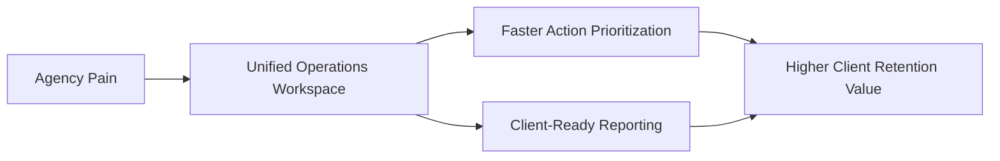

# Executive Scope

## Purpose
Provide a business-first definition of SurgeRank V1: why it exists, what outcome it must deliver, and how success will be measured.

## Executive Summary
- SurgeRank V1 is an agency-first SEO + GEO operations platform.
- The core outcome is faster, clearer client delivery: insight-to-report in one workspace.
- V1 prioritizes launch reliability and customer validation over feature breadth.
- Scope is balanced for a 12-20 week delivery window and design-partner-led rollout.

## Problem and Opportunity

| Current Agency Pain | Business Impact | V1 Response |
| --- | --- | --- |
| Tool fragmentation across SEO workflows | Slow operations, inconsistent reporting | Unified agency command center |
| Manual report preparation | Low margin, high delivery effort | Built-in dashboard + scheduled PDF reporting |
| Limited visibility in AI-generated answers | Missed early GEO demand | Baseline GEO monitoring for tracked queries |
| Multi-client oversight is difficult | Reactive service delivery | Cross-workspace health and trend visibility |

## V1 Objective
Deliver a commercially viable MVP that helps agencies:
1. onboard client workspaces quickly,
2. track SEO and early GEO signals reliably,
3. produce client-ready reports with minimal manual effort.

## Product Positioning

| Dimension | V1 Position |
| --- | --- |
| Target customer | Small and mid-size digital/SEO agencies |
| Core use case | Multi-client SEO/GEO operations and reporting |
| Differentiator | Agency workflow + GEO visibility baseline + report readiness |
| Buying rationale | Time savings, clearer value proof, affordable entry point |

## Success Metrics (V1 Program-Level)

| Metric | V1 Target |
| --- | --- |
| Time to first value | < 15 minutes |
| Day-10 activation | >= 70% |
| Week-4 retained usage | >= 60% |
| Pipeline success rate | >= 98% |
| Critical release quality | No unresolved P0/P1 |

## Scope Boundaries (High-Level)
- In scope: core onboarding, SEO audits, keyword tracking, limited GEO, reporting, launch operations.
- Out of scope: white-label portal, public API platform, full GEO depth, broad martech integrations.

Diagram interpretation: V1 value is created by reducing operational fragmentation and improving client communication quality.

## Key Decisions
- Scope profile: balanced V1 (12-20 weeks).
- Launch model: design-partner first, then controlled public rollout.
- Stack baseline: Next.js, Supabase, Vercel, GitHub CI/CD.

## Open Items
- Final packaging limits by tier.
- Final GEO engine coverage for launch wave 1.

## Next Actions
- Align executive scope with final pricing and launch gate ownership.
- Publish sign-off version with stakeholder approval status.
