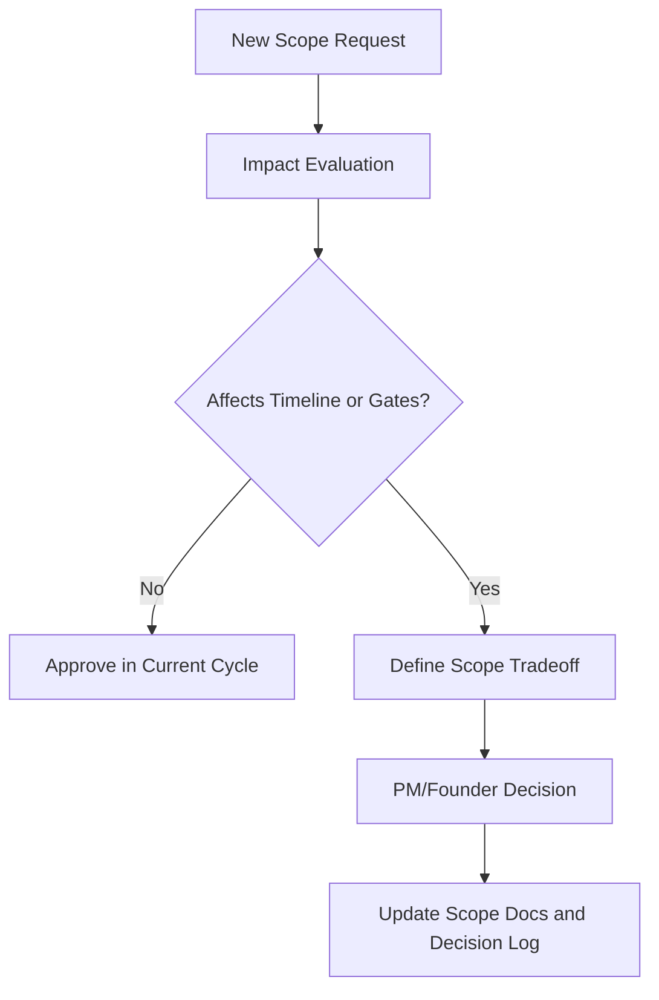

# Product Scope

## Purpose
Define the canonical V1 product boundary, priorities, acceptance criteria, and explicit deferrals.

## Executive Summary
- V1 scope is constrained to features required for onboarding, insight generation, and client reporting.
- P0 is mandatory for launch; P1 is included only if it does not jeopardize critical-path delivery.
- Any new scope requires trade-off approval and replacement logic.

## Scope Model

| Priority | Meaning | Release Rule |
| --- | --- | --- |
| P0 | Required for launch value | Must ship before launch |
| P1 | Strong value enhancer | Ship only if P0 remains on track |
| P2 | Nice-to-have or expansion | Deferred to V2+ unless reapproved |

## Module Scope Matrix

| Module | P0 Scope | P1 Scope | Deferred (V2+) |
| --- | --- | --- | --- |
| Agency and workspace core | Agency account, workspace CRUD, basic roles, plan-aware limits | Enhanced team role depth | Client portal and advanced white-label controls |
| SEO audits | Technical health score, issue buckets, crawl baseline | Expanded checks and trend explanations | Deep enterprise audit workflows |
| Keyword tracking | GSC import, manual keywords, rank trends, gainers/losers | Grouping/clustering basics | Advanced opportunity automation |
| GEO monitoring | Query setup, limited engine coverage, mention/citation trend | Competitor comparison enhancements | Full multi-engine GEO analytics suite |
| Competitor analysis | Basic competitor setup and rank comparison snapshot | Gap summary enhancements | Advanced backlink/content intelligence depth |
| Reporting | In-app dashboards, manual PDF export, schedule baseline | Richer report section controls | Full white-label report builder |

## In Scope (Detailed)

### P0 Must Have
- Agency onboarding and first workspace setup.
- Google Search Console integration and sync.
- SEO technical health reporting.
- Keyword rank tracking and trend visibility.
- Report export and scheduled delivery baseline.
- CI/CD, quality gates, and operational runbooks.

### P1 Should Have
- Competitor baseline comparison per workspace.
- Limited GEO trend and visibility evidence snapshots.

## Out of Scope (V2+)
- White-label customer portal.
- Public API product surface.
- Full GEO engine expansion and deep citation analytics.
- Broad CMS and martech connector ecosystem.
- Mobile app and non-core channel monitoring.

## Product Acceptance Criteria

| Area | Acceptance Criteria |
| --- | --- |
| Onboarding | Workspace is set up and populated with first insights in < 15 minutes |
| Data reliability | Core ingestion jobs succeed with >= 98% reliability |
| Insight usability | SEO and keyword trends are clear and actionable |
| Reporting | PDF exports and schedules work reliably in test and staging |
| Launch readiness | No unresolved P0/P1 defects for release candidate |

## Change Control Rules
- Every proposed scope change must include:
  - timeline impact,
  - dependency impact,
  - launch gate impact.
- Scope additions require explicit PM/founder decision and a corresponding scope reduction if needed.

Diagram interpretation: Scope governance protects launch outcomes by forcing explicit trade-offs for non-trivial changes.

## Key Decisions
- P0/P1/P2 boundaries are enforced as release governance.
- GEO is included as limited V1 differentiator, not full-platform depth.

## Open Items
- Final competitor limit by pricing tier.
- Report customization depth at launch.

## Next Actions
- Validate this scope matrix with engineering and QA owners.
- Lock acceptance criteria in release checklist and test plans.
