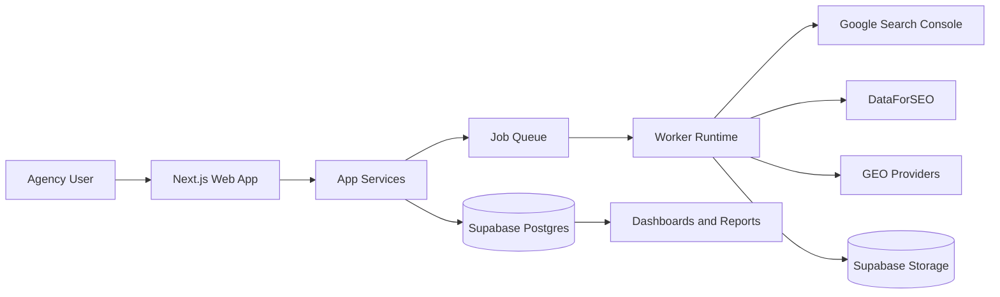

# Technical Scope

## Purpose
Define the technical boundaries, architecture decisions, integrations, and non-functional expectations for V1.

## Executive Summary
- V1 uses a modular monolith web app with async workers for expensive jobs.
- Supabase is the canonical data/auth/storage platform.
- Security and tenant isolation are mandatory, not optional.
- Architecture prioritizes simplicity and operational control before scale complexity.

## Canonical Technical Stack

| Layer | V1 Choice | Rationale |
| --- | --- | --- |
| Frontend | Next.js 16 + TypeScript + Tailwind v4 + shadcn/ui | Fast iteration, mature ecosystem |
| API and app logic | Next.js server actions/routes + modular services | Single-stack productivity |
| Database | Supabase Postgres | Relational model + governance controls |
| Auth | Supabase Auth | Built-in auth and policy integration |
| Storage | Supabase Storage | Report artifact storage with simple ops |
| Queue and workers | Worker runtime + Redis queue pattern | Async processing for ingestion/reporting |
| Deployment | Vercel (web) + worker runtime | Preview-first shipping model |
| CI/CD | GitHub Actions | Reliable release gates and automation |

## Architecture Boundaries

| Boundary | Responsibility | Out of Scope for V1 |
| --- | --- | --- |
| Web app | UI, API boundaries, orchestration | Heavy standalone microservice split |
| Worker | Crawls, sync jobs, GEO checks, report generation | Multi-region worker fleet |
| Data platform | Persistence, policies, storage | Enterprise data warehouse |
| Integration adapters | External provider abstraction | Universal integration marketplace |

Diagram interpretation: the app handles user orchestration while workers process external data and heavy tasks asynchronously.

## Data and Tenancy Constraints
- Tenant keys:
  - `agency_id` on tenant-scoped entities
  - `workspace_id` on workspace-scoped entities
- Authorization model:
  - membership-based access with row-level enforcement
- Validation:
  - tenant boundary tests are release-critical

## Integration Scope (V1)

| Provider | V1 Usage | Guardrails |
| --- | --- | --- |
| Google Search Console | Query/page performance source of truth | OAuth security, retry/backoff |
| DataForSEO | Keyword and market enrichment | usage caps + caching |
| GEO providers | Limited citation visibility checks | scope-limited query budget |

## Non-Functional Requirements

| Category | V1 Target |
| --- | --- |
| Reliability | >= 98% success on critical ingestion/report jobs |
| Security | Tenant isolation and role controls enforced |
| Performance | Responsive dashboard experience for core views |
| Cost control | Budget guardrails for external API spend |
| Operability | Deployment/rollback runbooks + health checks |

## Key Decisions
- Use modular monolith + worker pattern for V1.
- Keep scale complexity trigger-based, not speculative.

## Open Items
- Final queue implementation details by workload profile.
- Initial caching TTL strategy per integration endpoint.

## Next Actions
- Align technical scope with CI/CD and QA acceptance gates.
- Add concrete endpoint-level ownership map in engineering docs.
