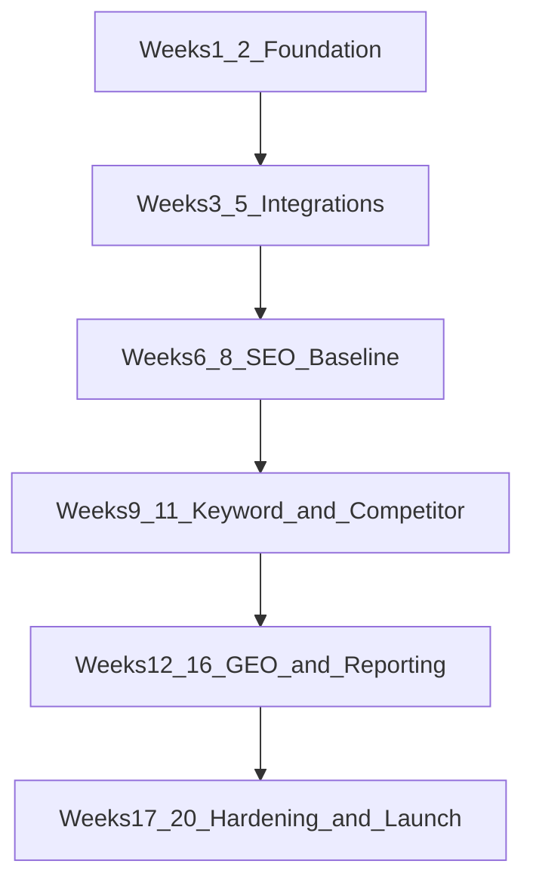
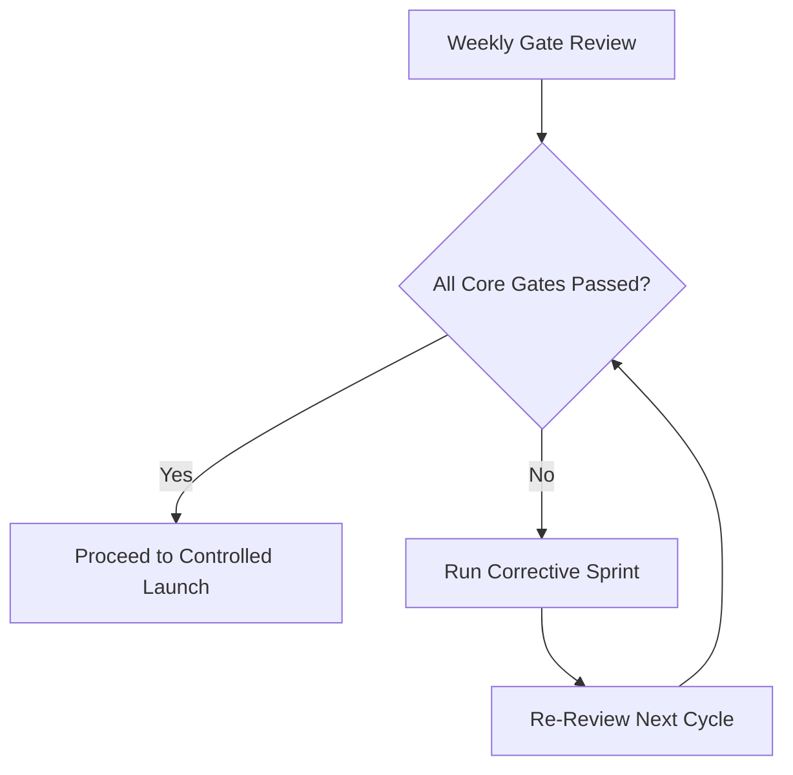

# Delivery and Launch Plan

## Purpose
Define delivery sequence, milestones, ownership, and launch decision logic for V1.

## Executive Summary
- Delivery follows a 20-week balanced plan with design-partner validation before public launch.
- Critical path stays focused on onboarding, data value, reporting, and release stability.
- Launch is metric-gated, not date-gated.

## Phase Plan (Balanced V1)

| Phase | Timeline | Primary Outcome |
| --- | --- | --- |
| Foundation | Weeks 1-2 | Auth, tenancy, baseline CI/CD, env setup |
| Core integrations | Weeks 3-5 | GSC sync and initial dashboard value |
| SEO baseline | Weeks 6-8 | Audit health scoring and issue visibility |
| Keyword and competitor baseline | Weeks 9-11 | Rank trends and competitor snapshots |
| GEO and reporting | Weeks 12-16 | Limited GEO + export/schedule reporting |
| Hardening and launch prep | Weeks 17-20 | Reliability, QA gates, partner launch readiness |

Diagram interpretation: sequence enforces value-first delivery and stabilization before launch.

## Critical Path
1. Workspace onboarding and tenant-safe access
2. GSC integration and baseline ingestion
3. SEO and keyword insight availability
4. Reporting workflow reliability
5. Launch gate pass

## Parallel Workstreams

| Stream | Focus | Owner Group |
| --- | --- | --- |
| Platform reliability | CI/CD, observability, rollback safety | Engineering |
| Product workflow quality | UX polish, acceptance criteria, QA | Engineering + QA |
| Launch operations | partner onboarding, scorecards, gate reviews | PM + Ops |

## Design-Partner Launch Plan

| Step | Target |
| --- | --- |
| Cohort size | 5-8 agencies |
| Validation period | 60-90 days |
| Weekly cadence | Product review + KPI check |
| Activation target | >= 70% by day 10 |
| Week-4 retained usage | >= 60% |

## Launch Gate Flow

Diagram interpretation: failed gates trigger corrective action cycles rather than rushed launches.

## Ownership Matrix

| Area | Primary Owner | Supporting Owner |
| --- | --- | --- |
| Scope control | PM | Founder |
| Technical delivery | Engineering | QA |
| Release readiness | QA | Engineering |
| Launch operations | PM/Ops | Engineering + Business |

## Key Decisions
- Launch requires gate-based approval.
- Corrective sprint path is mandatory for failed gate cycles.

## Open Items
- Final owner assignment by individual (not role).
- Final beta conversion offer structure.

## Next Actions
- Align this plan with weekly PM operating template.
- Publish milestone owner names and due dates.
