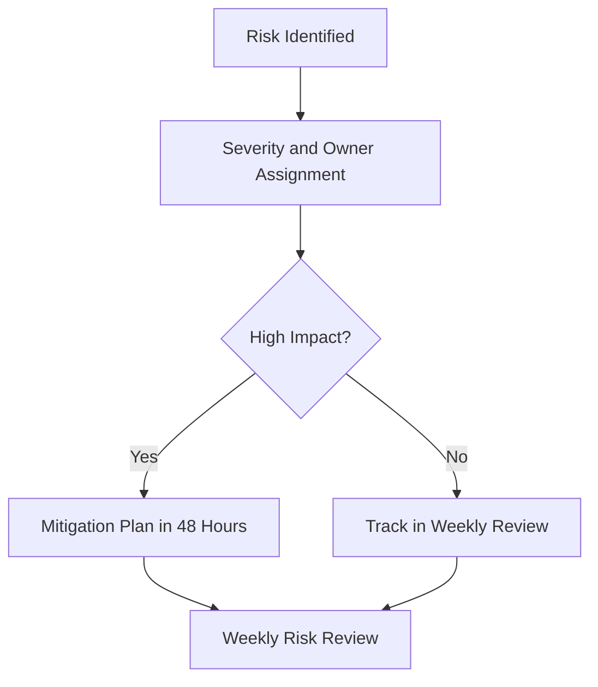

# Risks and Decisions

## Purpose
Summarize core V1 risks, mitigation strategy, and canonical scope decisions made during scope consolidation.

## Executive Summary
- Risk posture is manageable if scope discipline and release gates are enforced.
- Top risks are scope creep, provider instability, and data/tenancy reliability.
- This document captures the final reconciliation decisions from legacy scope sources.

## Top Risk Matrix

| Risk | Likelihood | Impact | Mitigation | Owner |
| --- | --- | --- | --- | --- |
| Scope creep during delivery | High | High | Enforce P0/P1 boundary and change-control approval | PM |
| Provider/API instability | Medium | High | Retries, fallbacks, stale-data messaging, adapter isolation | Engineering |
| Cross-tenant data leakage | Low | Critical | RLS + service auth checks + regression tests | Engineering/Security |
| Release regressions | Medium | High | QA gates, smoke checks, rollback runbook | QA/Engineering |
| External API cost overrun | Medium | Medium | budget caps, caching, usage alerts | PM/Engineering |
| GEO signal inconsistency | Medium | Medium | limited GEO scope and evidence snapshots | Product |

## Canonical Decision Summary

| Decision Area | Canonical Decision |
| --- | --- |
| Product name | SurgeRank |
| Scope profile | Balanced V1, 12-20 weeks |
| Launch approach | Design-partner first, then controlled public launch |
| GEO for V1 | Limited GEO scope, Pro+ monetization |
| Packaging baseline | Starter/Pro/Agency with fixed initial limits |
| Stack baseline | Next.js, Tailwind, Supabase, Vercel, GitHub CI/CD |
| Scope governance | Add/replace logic for non-trivial scope changes |

## Reconciliation Log (Legacy Scope Contradictions)

| Contradiction | Resolution |
| --- | --- |
| Pricing and limits differed between two legacy docs | Set one canonical pricing matrix in `05-pricing-and-business-model.md` |
| GEO placement in Starter plan conflicted | GEO moved to Pro+ for V1 |
| Team seat limits conflicted | Adopted enforceable fixed limits for V1 |
| API access timing conflicted | Deferred post-V1 |

## Risk Response Workflow

Diagram interpretation: high-impact risks receive immediate action, while lower-risk items are monitored in operating cadence.

## Sign-Off Tracker

| Reviewer Group | Status | Notes |
| --- | --- | --- |
| PM/Founder scope validation | Completed | Scope boundaries and priorities aligned |
| Engineering/QA feasibility validation | Completed | Technical and quality constraints aligned |
| Stakeholder readability validation | Completed | Package format approved for PDF sharing |

## Key Decisions
- This `docs/scope/` package is the canonical V1 scope set.
- Legacy DOCX scope files are scheduled for decommission after this approval cycle.

## Open Items
- None blocking this scope migration.

## Next Actions
- Mark scope package as active after legacy DOCX removal.
- Continue updates only through markdown package and decision log.
